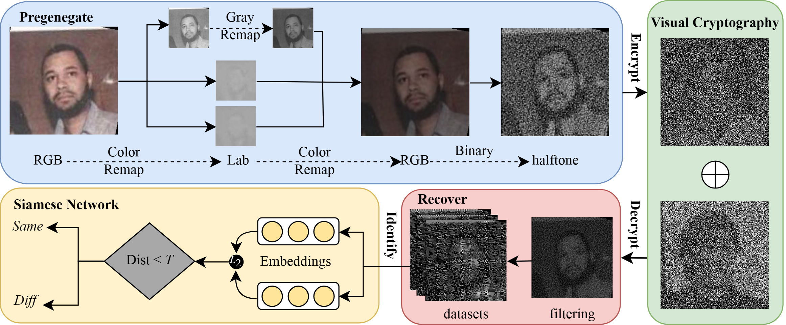

# LightLSB: A lightweight secure transmission mechanism for large-scale biometric images
<!-- -------------------------------------------------------- -->
This is a repository for the paper of "LightLSB". 

*You can also read a translated version of this file [in Chinese 简体中文版](README_cn.md).*

## Overview

<!-- -------------------------------------------------------- -->
Biometrics serve an important role in bridging the gap of trust between humans and the data-centric world. However, the security of biometrics itself is also constrained by data scale and encryption computing power.
The existing biometric encryption is based on computational complexity, which makes it difficult to securely transmit massive captured data. Lightweight encryption schemes based on secret sharing confront challenges in image quality and identification accuracy. To fill the gap,
This paper presents a lightweight and high-precision identification framework called LightLSB. The threshold characteristic of visual cryptography (VC) eliminates the complicated operation when encrypting images.

## Submodules
- CAM
  Comparison of heatmaps for decrypted images between ResNet50 and Ours Model(EfficientNet_b3).
- IQA
  Image Quality Assessment of the decrypted image of FVC2000 dataset through SADCNN and our inverse halftoning scheme with the original image.
- VCS
   Implementation of different Visual Cryptography schemes.
- models
  Performance of different models trained by LFW dataset.
## InvHT
`InvHT_Bilateral_Filters.py` is the implementation of ours decryption improvement scheme.